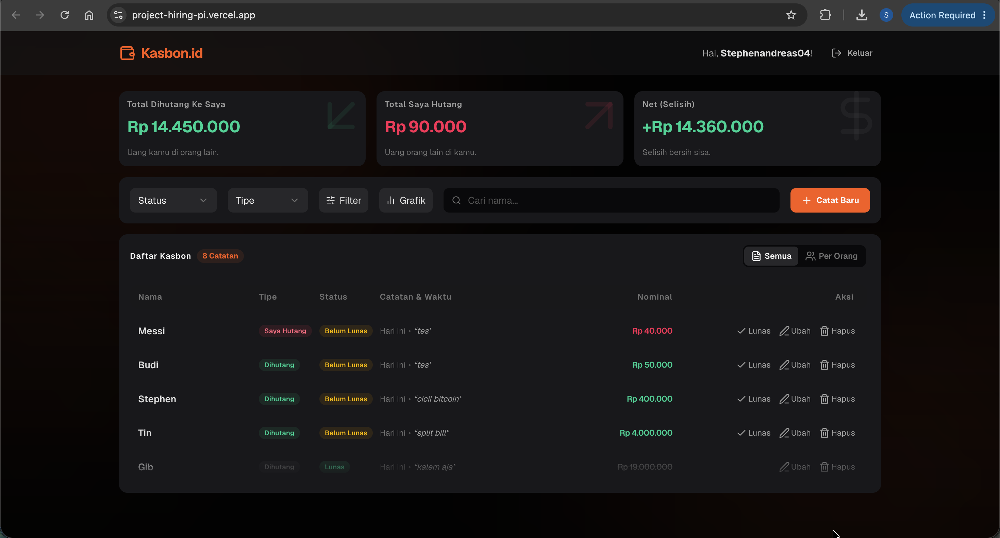
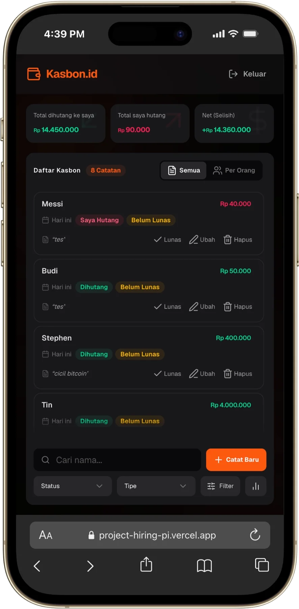

# Kasbon

Aplikasi web untuk mencatat dan mengelola utang piutang pribadi, dibangun dengan Next.js 16, TypeScript, dan Supabase.

<p align="center">
  
  &nbsp;&nbsp;
  
</p>

## Library Tambahan

| Library | Alasan |
| :--- | :--- |
| **Zod** | Validasi input *type-safe* di API Routes. Skema ditulis sekali dan langsung ter-infer ke tipe TypeScript, sehingga validasi dan tipe selalu sinkron tanpa duplikasi. |
| **Shadcn UI** | Koleksi komponen UI headless berbasis Radix UI yang aksesibel (keyboard navigation, focus trap, ARIA-compliant) — dipakai untuk Dialog, Select, Radio Group, Popover, dan Calendar. |
| **Framer Motion** | Animasi transisi halus pada halaman login/signup (fade + slide-up), serta animasi CRUD pada list transaksi (stagger masuk, slide-out saat hapus) dan pesan error/sukses (height collapse). |

---

---

## Setup

### 1. Prerequisites
- Node.js v20+

### 2. Install Dependencies
```bash
npm install
```

---

### Opsi A — Supabase Cloud (Hosted)

Cocok jika sudah punya akun [supabase.com](https://supabase.com).

**3A. Environment Variables**

Buat file `.env.local`:
```env
NEXT_PUBLIC_SUPABASE_URL=https://<project-id>.supabase.co
NEXT_PUBLIC_SUPABASE_ANON_KEY=<anon-key>
```

**4A. Migration — via SQL Editor (tanpa CLI)**

1. Buka dashboard Supabase → **SQL Editor**
2. Copy isi [`supabase/migrations/20260612000000_init_debts.sql`](./supabase/migrations/20260612000000_init_debts.sql)
3. Paste → klik **Run**

**4A. Migration — via Supabase CLI**
```bash
supabase login
supabase link --project-ref <project-id>
supabase db push
```

---

### Opsi B — Local / Offline (tanpa internet, pakai Docker)

Cocok untuk development offline penuh. Butuh [Docker Desktop](https://www.docker.com/products/docker-desktop/) terinstall.

**3B. Install Supabase CLI**
```bash
brew install supabase/tap/supabase
```

**4B. Jalankan Supabase Lokal**
```bash
supabase start
```
Setelah berjalan, CLI akan menampilkan `API URL` dan `anon key` lokal.

**5B. Environment Variables**

Buat file `.env.local` dengan nilai dari output `supabase start`:
```env
NEXT_PUBLIC_SUPABASE_URL=http://127.0.0.1:54321
NEXT_PUBLIC_SUPABASE_ANON_KEY=<anon-key-lokal>
```

**6B. Jalankan Migration**
```bash
supabase db reset
```
Perintah ini otomatis menjalankan semua file di `supabase/migrations/`.

---

### Jalankan Aplikasi
```bash
npm run dev
```
Buka [http://localhost:3000](http://localhost:3000).

---

## Demo

**[https://project-hiring-pi.vercel.app](https://project-hiring-pi.vercel.app)**


---

## Approach

Keputusan teknis yang paling saya banggakan adalah pemisahan state logic dashboard menggunakan custom hook orchestrator (`useDebtDashboard`) secara terpusat. Hal ini membuat layer komponen UI (`ListViewContent`, `GroupedViewContent`, `DebtItem`) tetap bersih, reusable, dan bebas dari clutter state management.

---

## Trade-off

Jika ada 1 hari lagi:

1. **Optimasi Caching & State** — Pake React Query (SWR) biar load data kasbon makin instan dan ga boros hit request ke Supabase API.

---

## Time Spent

~4.5 jam total:
- Analysis & Database Setup: 1 jam
- Authentication & Route Guard Middleware: 1 jam
- REST API & Type-safe Validation: 1 jam
- UI Dashboard & Bonus Features: 1.5 jam
